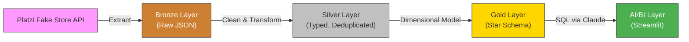
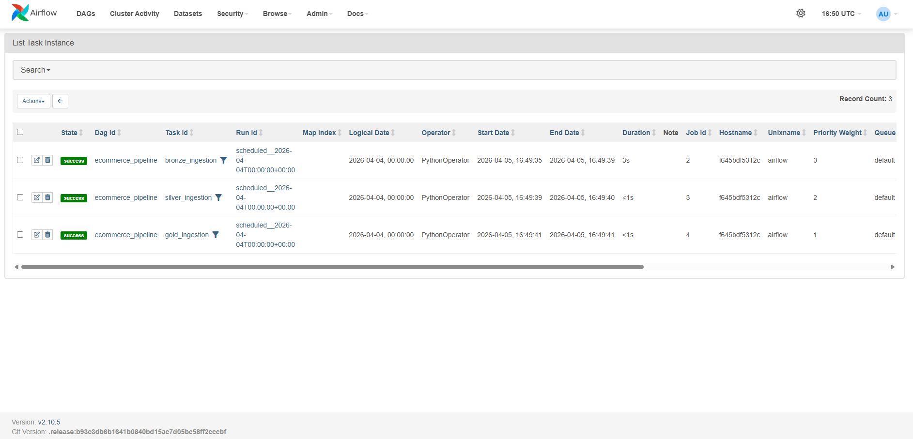
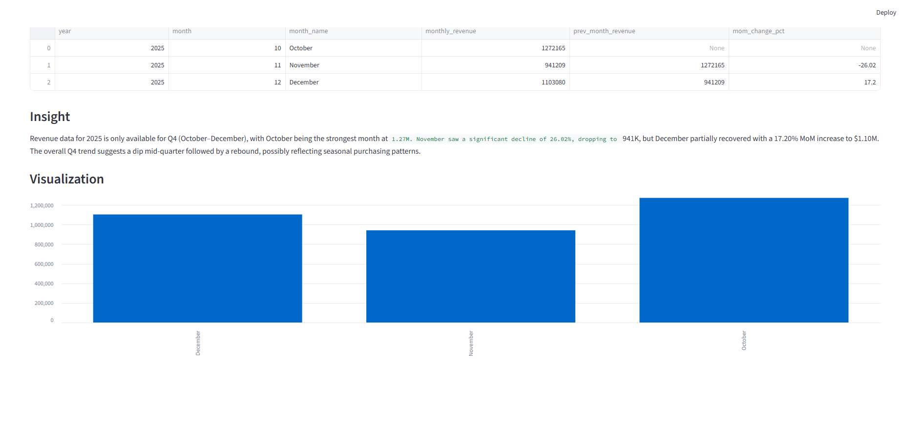
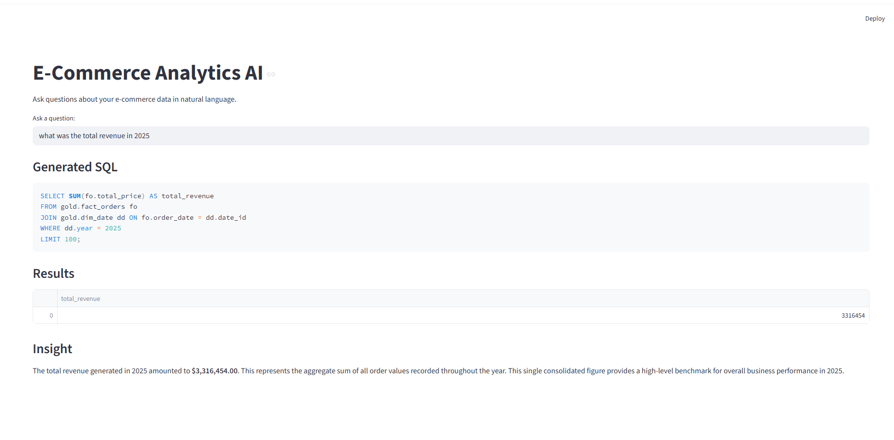
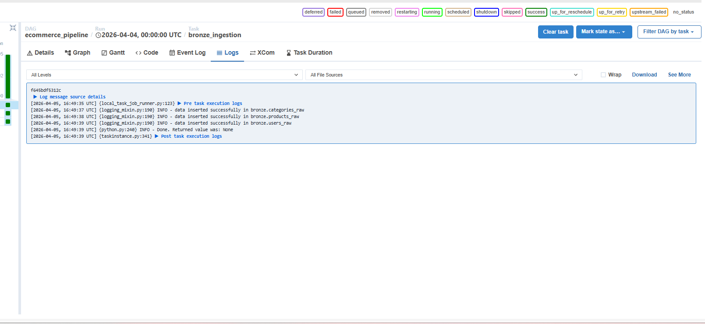
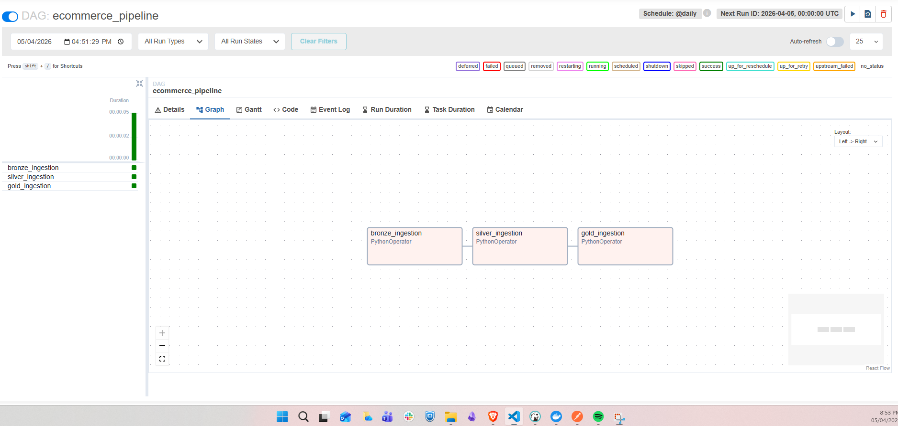
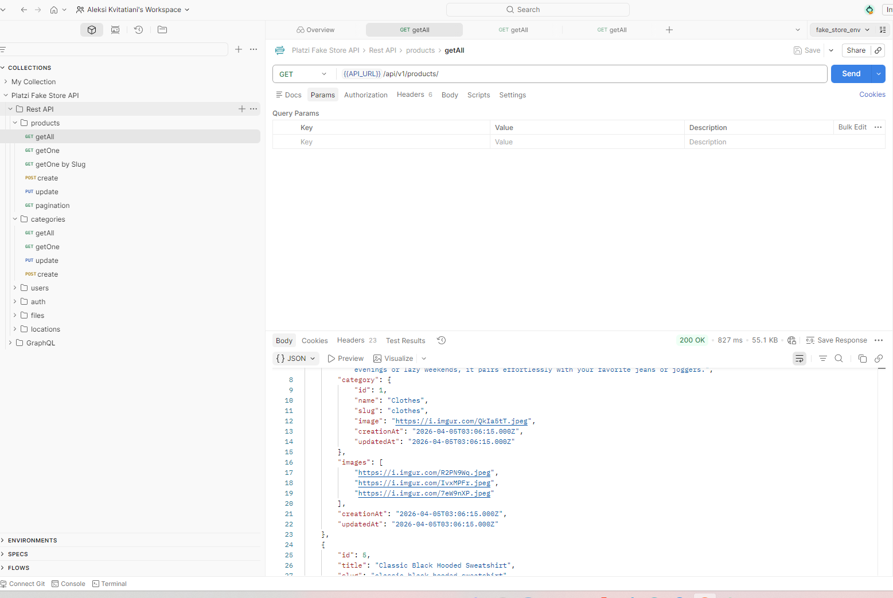
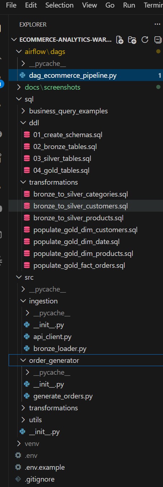
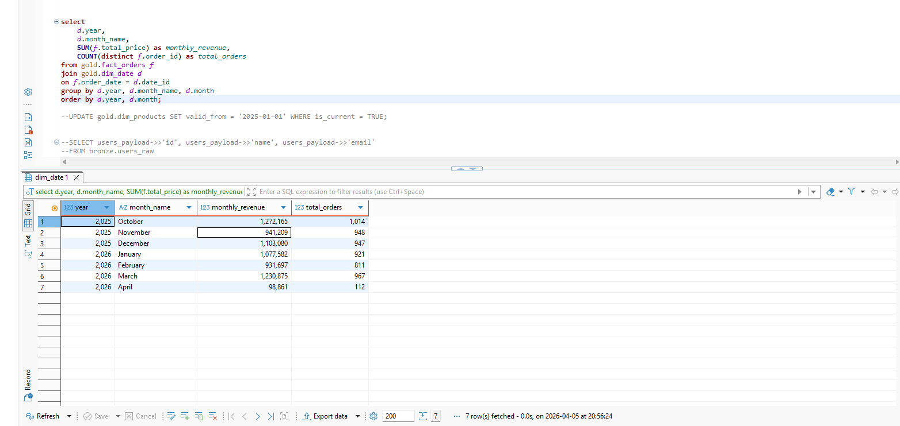

# E-Commerce Analytics Warehouse

> End-to-end data warehouse with medallion architecture, orchestrated ETL, and an AI layer that lets users query data in plain English.

Came across a medallion architecture post on Medium, got curious, and decided the best way to understand it was to build the whole thing from scratch. I have built dwh at much bigger scale at work, that was before medallion got hyped, but turns out what I've built before is very similar conceptually. 

## Architecture



**Bronze** — Raw JSON dumped straight from the API. Append-only, no transformations. If the source schema changes tomorrow, nothing breaks here.

**Silver** — Cleaned, typed, deduplicated. Junk categories filtered out with regex, customers deduplicated by email, products validated against foreign keys. This is where data quality happens.

**Gold** — Star schema with fact and dimension tables. SCD Type 2 on products (price changes tracked over time). This is what analysts and the AI layer query against.

**AI/BI Layer** — Streamlit app where users type questions in natural language. Claude translates them to SQL, runs them against the gold layer through a read-only connection, and returns results with auto-generated insights and charts.

## Tech Stack

| Component | Technology | Why |
|---|---|---|
| Warehouse | PostgreSQL 15 | Industry standard, runs in Docker, full SQL support |
| Orchestration | Apache Airflow | DAG-based scheduling, task dependencies and idempotency |
| AI Layer | Streamlit + Claude API | Fast to build, interactive, natural language to SQL |
| Infrastructure | Docker Compose | Reproducible local environment, one command to start |
| Tunnel | ngrok | Expose local app for demos without deploying to cloud |

## Project Structure

```
ecommerce-analytics-warehouse/
├── airflow/dags/              # Airflow DAG definition
├── sql/
│   ├── ddl/                   # Schema and table definitions (bronze, silver, gold)
│   ├── transformations/       # SQL scripts for layer-to-layer ETL
│   └── business_query_examples/
├── src/
│   ├── ingestion/             # API client + bronze loader
│   ├── transformations/       # Python runners for silver and gold transforms
│   ├── order_generator/       # Synthetic order data generator
│   ├── ai_query/              # Streamlit app (natural language SQL)
│   └── utils/                 # DB connection helpers
├── docs/screenshots/
├── docker-compose.yml
├── requirements.txt
└── .env.example
```

## How to Run

### Prerequisites
- Docker and Docker Compose
- Python 3.10+
- An [Anthropic API key](https://console.anthropic.com/) (for the AI layer)

### 1. Clone and configure

```bash
git clone <repo-url>
cd ecommerce-analytics-warehouse
cp .env.example .env
# Edit .env with your passwords and API key
```

### 2. Start the database

```bash
docker compose up postgres -d
```

### 3. Create the schemas and tables

Run the DDL scripts in order against your database:

```bash
psql -h localhost -U warehouse_user -d ecommerce_warehouse -f sql/ddl/01_create_schemas.sql
psql -h localhost -U warehouse_user -d ecommerce_warehouse -f sql/ddl/02_bronze_tables.sql
psql -h localhost -U warehouse_user -d ecommerce_warehouse -f sql/ddl/03_silver_tables.sql
psql -h localhost -U warehouse_user -d ecommerce_warehouse -f sql/ddl/04_gold_tables.sql
```

### 4. Install Python dependencies

```bash
pip install -r requirements.txt
```

### 5. Run the pipeline

```bash
# Ingest from API into bronze
python -m src.ingestion.bronze_loader

# Transform bronze to silver
python -m src.transformations.bronze_to_silver

# Generate synthetic orders
python -m src.order_generator.generate_orders

# Populate gold layer
python -m src.transformations.silver_to_gold
```

### 6. Create the read-only user (for the AI layer)

```sql
CREATE USER bi_readonly WITH PASSWORD 'your_readonly_password';
GRANT CONNECT ON DATABASE ecommerce_warehouse TO bi_readonly;
GRANT USAGE ON SCHEMA gold TO bi_readonly;
GRANT SELECT ON ALL TABLES IN SCHEMA gold TO bi_readonly;
ALTER DEFAULT PRIVILEGES IN SCHEMA gold GRANT SELECT ON TABLES TO bi_readonly;
```

### 7. Launch the AI layer

```bash
streamlit run src/ai_query/app.py
```

Open `http://localhost:8501` and start asking questions.

### Optional: Expose publicly with ngrok

```bash
ngrok http 8501
```

## Screenshots


<!--  -->

<!--  -->







## Key Design Decisions

This was a deliberate architecture exercise — building out each layer to pressure-test the patterns before applying them in production contexts.

- **Medallion over flat staging** — clean separation of raw, validated, and business-ready data; each layer has a clear contract
- **Idempotent pipelines** — truncate-reload with pre-checks so reruns are always safe
- **SCD Type 2 on products** — price history preserved in the dimension, fact table joins are date-range aware
- **Read-only AI layer** — defense in depth: dedicated DB user + connection-level read-only mode, so AI-generated SQL can't mutate data
- **Orchestration with Airflow** — DAG enforces bronze >> silver >> gold dependency chain; failures don't cascade
